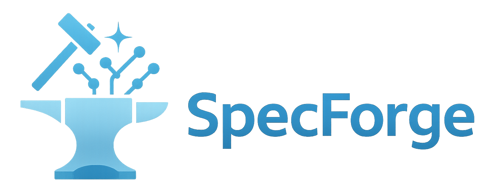

<div align="center" id="sglangtop">
</img>

[](https://lmsys.org/blog/2025-07-25-spec-forge/)
[](https://sgl-fru7574.slack.com/archives/C09784E3EN6)
[](https://huggingface.co/collections/lmsys/eagle-3-6886b2329f3998a8bc23f8ed)
[](./LICENSE)

</div>


## Table of Contents

- [📍 Overview](#-overview)
    - [🤔 Why SpecForge?](#-why-specforge)
    - [🔥 Which training mode should I use?](#-which-training-mode-should-i-use)
    - [⚡️ SGLang-ready](#️-sglang-ready)
- [📦 Installation](#-installation)
- [📝 Data Preparation](#-data-preparation)
    - [☁️ Prepare Online Training Dataset](#️-prepare-online-training-dataset)
    - [💾 Prepare Offline Training Dataset](#-prepare-offline-training-dataset)
    - [🤩 Prepare your own dataset](#-prepare-your-own-dataset)
- [🚀 Training](#-training)
    - [🏎️ Online Training](#️-online-training)
    - [💨 Offline Training](#-offline-training)
    - [📈 Wandb Integration](#-wandb-integration)
- [💡 Customize Your Own Training](#-customize-your-own-training)
    - [🔧 Customize Training Args](#-customize-training-args)
    - [💬 Customize Chat Template](#-customize-chat-template)
    - [🪅 Customize model](#-customize-model)
- [🤖 Serving and Benchmarking On SGLang](#-serving-and-benchmarking-on-sglang)
- [✨ Acknowledgements](#-acknowledgements)
- [💡 Special Thanks to Voltage Park](#-special-thanks-to-voltage-park)

## 📍 Overview

SpecForge is an ecosystem project developed by the SGLang team. It is a framework for training speculative decoding models so that you can smoothly port them over to the SGLang serving framework to speed up your inference.

Particularly, we offer two ways to train your eagle model. One is **online training**, which means freezing target model and training draft model at same time. The other is **offline training**, which means generating and saving the hidden states using the target model first and then training the draft model in a separate process.

### 🤔 Why SpecForge?

We have seen many open-source projects for speculative decoding, but most of them are not well-maintained or not directly compatible with SGLang. We prepared this project because we wish that the open-source community can enjoy a speculative decoding framework that is
- regularly maintained by the SGLang team: the code is runnable out-of-the-box
- directly compatible with SGLang: there is no additional efforts for porting to SGLang
- provide performant training capabilities: we provided online/offline/tensor-parallel/FSDP to suit your needs

### 🚀 Which training mode should I use?

We provide two orthogonal paths so everyone can start training in minutes, regardless of hardware budget — both are actively maintained, battle-tested daily in our CI, and guaranteed runnable out-of-the-box. Below is a comparison of the two methods.

| Method | Target Model | Disk Space Requirement | GPU Requirement | One-liner rationale |
| --- | --- | --- | --- | --- |
| Online | Used during training | Small | More GPUs are needed if your target model is large | Generating auxiliary hidden states on the fly |
| Offline | Only used during data preparation | Huge (e.g. ultrachat+sharegpt will need 12TB storage ) | as low as 1 GPU, as only need to accommodate the draft model  | Preparing auxiliary hidden states beforehand and only once |

> **Why does disk matter?**
> During Eagle3 training, the frozen target model will first generate the hidden states for each token given the data sample. The hidden states are fed to the draft model for training.
> Offline mode stores these hidden states to the local disk, so a small disk can be filled up fast.
> Online mode only generates these hidden states on the fly without storing them to the disk, but needs to keep the target model resident in memory during training, trading GPU RAM for almost-zero disk footprint.

### ⚡️ SGLang-ready

Whichever mode you pick, the checkpoint format is **byte-for-byte compatible** with [SGLang](https://github.com/sgl-project/sglang). There is no post-processing or weights manipulation required.

Happy training!


## 📦 Installation

To install this project, you can simply run the following command.

```bash
pip install -v .
```

## 📝 Data Preparation

In this section, we will introduce how to prepare the dataset for both online and offline training. As mentioned in the [Overview](#-overview) section, online training only requires the raw dataset while offline training requires the hidden states generated from the target model. In the section below, we will introduce how to prepare both the raw dataset and the hidden states.

### ☁️ Prepare Online Training Dataset

We have provided a script to prepare some sample datasets including ultrachat (200k) and sharegpt (120k) for demo purpose. You can easily process the dataset by running the following command. The jsonl files will be placed in the `cache/dataset/<dataset_name>` directory of the project path by default. These datasets will be processed into `jsonl` files, which are the raw dataset ready for online training!

```bash
# ultrachat
python scripts/prepare_data.py --dataset ultrachat

# sharegpt
python scripts/prepare_data.py --dataset sharegpt
```

### 💾 Prepare Offline Training Dataset

Compared to online data, offline data requires one more step for hidden states generation. Thus, before you delve into this section, make sure you have your `jsonl` files ready as mentioned in the [Prepare Online Training Dataset](#-prepare-online-training-dataset) section. Once you have the `jsonl` files, you can start the hidden states generation.

You can run the following command to obtain the hidden states.

```bash
torchrun --nproc_per_node=8 \
    scripts/prepare_hidden_states.py \
    --model-path <target-model-path> \
    --enable-aux-hidden-states \
    --data-path <jsonl-file-path> \
    --chat-template llama3 \
    --max-length 2048 \
    --tp-size 8 \
    --batch-size 4 \
    --mem-frac=0.75 \
    --num-samples 1000
```
> ⚠️ This extract may take 2 hours and about 5T Disk

You need to specify the following arguments:
- `--model-path`: this is the huggingface repo name or path to the target model.
- `--data-path`: this is actual output path from the previous `prepare_data.py` script.
- `--chat-template`: this is the chat template to use for this model.
- `--num-samples`: this specifies how many data samples to use for hidden states generation. By default it will use all the data from `data-path`.


### 🤩 Prepare your own dataset

Besides the provided ShareGPT/Ultrachat datasets, you can also prepare your own dataset. You should prepare the dataset in jsonl format and the schema should look like this:

```json
{
    "id": "xxxx",
    "conversations": [
        {
            "role": "user | assistant",
            "content": "The message content"
        }
    ],
}
```

Once you have the `jsonl` file ready, you can go straight for online training or hidden states generation for offline training.

If you have multiple datasets, you can just merge them into the one jsonl file. For example, you can do something like this

```bash
cat dataset1.jsonl dataset2.jsonl > merged_dataset.jsonl
```


## 🚀 Training

### 🏎️ Online Training

We have provided a simple startup script to train the Eagle3 model for the Llama 3 and 4, Qwen3 models. You can run the following command to start the training.

```bash
# make sure you have sharegpt data prepared
# train llama3-8B-instruct
bash ./examples/run_llama3_eagle3_online.sh

# train llama4-scout
bash ./examples/run_llama4_eagle3_online.sh

# train Qwen3-30B-A3B
# Qwen3-235B-A22B online training is also supported;
# the relevant code is included in the script (currently commented out).
bash ./examples/run_qwen3_moe_eagle3_online.sh

# train Qwen3-8B
bash ./examples/run_qwen3_dense_eagle3_online.sh
```

### 💨 Offline Training

We have provided a simple startup script to train the Eagle3 model for Llama-3.1-8B-Instruct model in an offline manner. You can run the following command to start the training. Almost Everything is the same as the Online Training Step, except that you don't need to configure anything about target model. Instead, you need to pass `--train-hidden-states-path` to the file.

```bash
# make sure you have sharegpt data prepared
bash ./examples/run_llama3_eagle3_offline.sh
```

### 📈 Wandb Integration

If you wish to log the training progress to Wandb, you can add `--wandb`, `--wandb-key`, `--wandb-project` and `--wandb-name` to the command line in the provided sh file.

## 💡 Customize Your Own Training

### 🔧 Customize Training Args

```bash
torchrun \
    --standalone \
    --nproc_per_node 8 \
    ./scripts/train_eagle3_online.py \
    --target-model-path meta-llama/Llama-3.1-8B-Instruct \
    --draft-model-config ./configs/llama3-8B-eagle3.json \
    --train-data-path ./cache/dataset/sharegpt.jsonl \
    --output-dir ./outputs/llama3-8b-eagle3 \
    --num-epochs 10 \
    --batch-size 1 \
    --learning-rate 1e-4 \
    --max-length 2048 \
    --chat-template llama3 \
    --cache-dir ./cache
```

If you wish to understand what each argument does, you can run `python scripts/train_eagle3_online.py --help` to see the full list of arguments. Particularly, we will discuss some important arguments below.
- `--chat-template`: This should be the chat template to use for the model, so please make sure you set it to the correct value.
- `--cache-dir`: This directory contains the dataset cache including the `input_ids`, `loss_mask`, `attention_mask` and `vocab_mapping`. These caches can make your data loading much faster once a cache is generated. The cache file has a name which is obtained by hashing the dataset path to avoid cache collision. **However, if you use the same cache for different models, that might cause problems because configs like vocab size is not consistent for different models. Thus please delete the old cache before you start training with a new model.**

### 💬 Customize Chat Template

You can register a new chat template for your model by adding a new entry to the `TEMPLATE_REGISTRY` in the `specforge.data.template.py` file.

```python
TEMPLATE_REGISTRY.register(
    name="your-template-name",
    template=ChatTemplate(
        assistant_header="xxx",
        user_header="xxx",
        system_prompt="xxx",
        end_of_turn_token="xxx",
    ),
)
```

### 🪅 Customize Model

#### Customize Target Model

If you wish to train Eagle3 for other models, you need to modify the `--target-model-path` value. We support loading these models directly from HuggingFace.

However, if your model is too large and requires tensor parallelism, you can implement its tensor parallel version on your own in the `specforge.modeling.target` directory. The CausalLM model should inherit the `DistributedTargetModel` class in the `specforge.modeling.target.base.py` file and apply `ColumnParallelLinear` and `RowParallelLinear` to its submodules.

```python
from .base import DistributedTargetModel
from specforge.layers.linear import ColumnParallelLinear, RowParallelLinear


class MyModelForCausalLM(MyModelPreTrainedModel, GenerationMixin, DistributedTargetModel):
    ...

    def load_weights(self, state_dict: Dict[str, torch.Tensor]):
        ...
```

Afterwards, you need to register this model to the `AutoEagle3TargetModel` class in the `specforge.modeling.auto.py` file.

```diff
class AutoDistributedTargetModel(AutoModelForCausalLMBase):
    _model_mapping = {
        Llama4TextConfig: [Llama4ForCausalLM],
+       MyModelConfig: [MyModelForCausalLM],
    }
```

When `tp_size` is greater than 1, the script will automatically load the distributed version of the model for tensor parallelism.

#### Customize Draft Model

If you want to change the draft model configuration, you can write your own configuration file and pass its path to the `--draft-model-config` argument. If you wish to serve your customized draft model with SGLang, make sure you implement the draft model in SGLang as well and the architecture name must match. To implement your own draft model, you can create a new class and inherit it from the `Eagle3DraftModel` class in the `specforge.modeling.draft.base.py` file.


```python
from .base import Eagle3DraftModel
from transformers import PretrainedConfig


class MyModelConfig(PretrainedConfig):
    model_type = "mymodel"

    def __init__(self, **kwargs):
        ...


class MyModelEagle3(Eagle3DraftModel):

    config_class = MyModelConfig

    def __init__(self, config, quant_config=None) -> None:
        ...
```

You can then register these models to the `AutoEagle3TargetModel` and `AutoDraftModelConfig` classes in the `specforge.modeling.auto.py` file for the automatic model loading.

```diff
class AutoEagle3DraftModel(AutoModelForCausalLMBase):
    # the model mapping is currently hardcoded, we should support lazy model mapping via registry
    _model_mapping = {
        LlamaConfig: [LlamaForCausalLMEagle3],
+       MyModelConfig: MyModelEagle3,
    }


class AutoDraftModelConfig:

    _config_mapping = {
        "LlamaForCausalLMEagle3": LlamaConfig,
+       "MyModelEagle3": MyModelConfig,
    }
```

In this way, as long as your `config.json` specifies the correct architecture name, the script will automatically load the correct draft model for you.

## 🤖 Serving and Benchmarking On SGLang

Please refer to the [benchmarks](./benchmarks/README.md) document for more details.

## ✨ Acknowledgements

</img>

We would like to express our sincere gratitude to the official EAGLE team, especially Hongyang Zhang and Yuhui Li, for their invaluable contributions and support. Our thanks also go to the NVIDIA team—particularly Avery H and Izzy Putterman—and to the Google team, especially Ying Wang, for their insightful discussions and generous assistance throughout the project.

We are especially grateful to Meituan for their strong backing and meaningful contributions, which played a vital role in driving this project forward.

This project has also been inspired by many outstanding open-source projects from the LLM community, including [EAGLE](https://github.com/SafeAILab/EAGLE), [BaldEagle](https://github.com/NickL77/BaldEagle), and [TensorRT-Model-Optimizer](https://github.com/NVIDIA/TensorRT-Model-Optimizer) and others. Their contributions and shared knowledge have greatly benefited our work.

## 💡 Special Thanks to Voltage Park

We would like to extend our sincere thanks to [Voltage Park](https://www.voltagepark.com/), our official infrastructure partner. As part of a formal collaboration with the SGLang team, Voltage Park provided critical GPU resources that empowered us to train and evaluate large-scale speculative decoding models efficiently and reliably. This partnership was instrumental in making SpecForge possible. We deeply appreciate Voltage Park’s mission to make cutting-edge AI infrastructure more accessible, and we look forward to continued collaboration as we push the boundaries of open-source LLM serving and optimization.
